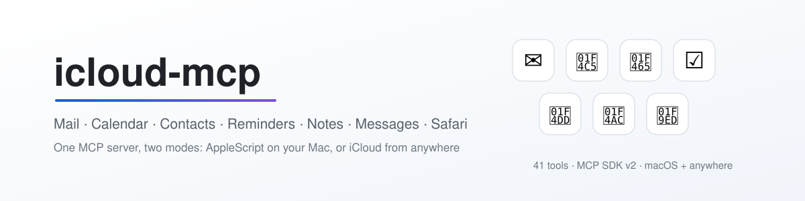

<picture>
  <source media="(prefers-color-scheme: dark)" srcset="assets/banner-dark.svg">
  
</picture>

<div align="center">

[](https://github.com/MrGo2/icloud-mcp/actions/workflows/ci.yml)
[](https://github.com/MrGo2/icloud-mcp/releases/latest)
[](LICENSE)
[](package.json)
[](https://modelcontextprotocol.io)

</div>

icloud-mcp covers seven Apple services with two interchangeable backends, and as far as we know it is the only MCP server that does. In local mode it drives the native macOS apps through AppleScript: no credentials, no network, and it reaches the services the iCloud protocols do not expose (Reminders, Notes, Messages, Safari). In cloud mode it speaks IMAP/SMTP, CalDAV and CardDAV instead, so it runs on any machine, not just a Mac. The `set-mode` tool switches between the two at runtime, without a restart.

[](https://insiders.vscode.dev/redirect/mcp/install?name=icloud&config=%7B%22command%22%3A%22npx%22%2C%22args%22%3A%5B%22-y%22%2C%22mcp-icloud%22%5D%7D)

## Features

The server exposes 41 tools across Email, Calendar, Contacts, Reminders, Notes, Messages and Safari. Each tool carries a typed schema, a human title and behavioural annotations, and every `list-*` tool returns machine-readable `structuredContent` alongside its text output. Local mode needs no passwords at all; macOS Automation permissions take their place.

## Access and security model

The server speaks JSON-RPC over stdin/stdout only. It opens no ports and listens on no socket.

Credentials are never logged. `ICLOUD_APP_PASSWORD` is read once at startup and handed only to the IMAP/SMTP/CalDAV/CardDAV clients; diagnostics print a fixed mask, never the value. Where you keep the password is up to you: a `.env` file beside the module for a manual install, or the `.mcpb` bundle's sensitive field, which the host stores in the macOS Keychain. Local mode has no password anywhere, since macOS gates access per app through its own Automation prompts, and you can revoke those at any time.

Every tool argument is validated against a zod schema before the handler runs. Arguments are also coerced at each AppleScript interpolation site, so a value that is not a number cannot reach a script template.

## Tools

Tools marked local only return an error in cloud mode, because the iCloud protocols do not expose those services.

### Authentication

- **about**
  - Returns information about this server, the active mode and whether credentials are configured
  - No input
- **check-auth-status**
  - Verifies credentials are usable for the active mode
  - No input
- **set-mode**
  - Switches between local and cloud without restarting
  - Input: `mode` (string, `local` or `cloud`)

### Email

- **list-emails**: `folder` (string, optional), `count` (number, optional, max 50)
- **read-email**: `uid` (string), `folder` (string, optional)
- **send-email**: `to`, `subject`, `body` (strings); `cc`, `bcc` (strings, optional); `isHtml` (boolean, optional, cloud mode only)
- **search-emails**: `query`, `from`, `subject`, `folder` (strings, optional), `unreadOnly` (boolean, optional), `count` (number, optional)
- **mark-as-read**: `uid` (string), `folder` (string, optional), `isRead` (boolean, optional)
- **list-folders**: no input

### Calendar

- **list-events**: `count` (number, optional, max 50), `daysAhead` (number, optional)
- **create-event**: `summary`, `start`, `end` (strings, ISO 8601); `description`, `location` (optional); `calendarUrl` (cloud) or `calendarName` (local)
- **update-event**: `eventUrl` (string); any of `summary`, `start`, `end`, `description`, `location`. Only the fields you pass change
- **delete-event**: `eventUrl` (string)
- **list-calendars**: no input

### Contacts

- **list-contacts**: `count` (number, optional, max 50)
- **search-contacts**: `query` (string), `count` (number, optional). Matches name, organisation, email and phone; phone matching ignores formatting
- **read-contact**: `contactUrl` (string)
- **create-contact**: `displayName`, `firstName`, `lastName`, `email`, `phone`, `organization`, `title`, `notes` (all optional)
- **delete-contact**: `contactUrl` (string)
- **list-contact-accounts**: no input (local only)
- **list-contact-groups**: `accountId` (string, optional) (local only)

### Reminders (local only)

- **list-reminder-lists**: no input
- **list-reminders**: `listName` (string, optional), `includeCompleted` (boolean, optional), `count` (number, optional)
- **create-reminder**: `name` (string); `body`, `dueDate`, `listName` (optional); `priority` (number 0-9, optional)
- **update-reminder**: `reminderId` (string); any of `name`, `body`, `dueDate`, `priority`
- **complete-reminder**: `reminderId` (string), `completed` (boolean, optional)
- **delete-reminder**: `reminderId` (string)
- **search-reminders**: `query` (string), `count` (number, optional)

### Notes (local only)

- **list-note-folders**: no input
- **list-notes**: `folderName` (string, optional), `count` (number, optional)
- **read-note**: `noteId` (string)
- **create-note**: `title` (string), `body` (string, optional), `folderName` (string, optional)
- **search-notes**: `query` (string), `count` (number, optional)

### Messages (local only)

Reading requires the [`imsg`](https://github.com/steipete/imsg) CLI and Full Disk Access.

- **list-chats**: `limit` (number, optional)
- **read-messages**: `chatId` (number); `limit` (number, optional); `start`, `end` (ISO 8601, optional); `attachments` (boolean, optional)
- **send-message**: `to` (string), `body` (string), `file` (string, optional)
- **react-message**: `chatId` (number), `type` (`love`, `like`, `dislike`, `laugh`, `emphasis`, `question`)

### Safari (local only)

- **list-safari-tabs**: no input
- **get-current-safari-url**: no input
- **open-safari-url**: `url` (string), `inNewWindow` (boolean, optional)
- **close-safari-tab**: `windowIndex` (number, optional), `tabIndex` (number, optional)

### Tool annotations (MCP hints)

Every tool declares its behaviour explicitly instead of relying on the spec defaults, which are deliberately pessimistic. All `list-*`, `read-*`, `search-*` and `get-*` tools, plus `about` and `check-auth-status`, are marked read-only. The four destructive tools (`delete-event`, `delete-contact`, `delete-reminder`, `close-safari-tab`) carry `destructiveHint`. Tools that reach the network or another person carry `openWorldHint`: all Email and Calendar tools, `send-message`, `react-message` and `open-safari-url`. The read-only tools plus `mark-as-read`, `complete-reminder`, `update-reminder`, `update-event` and `set-mode` are marked idempotent.

## Installation

Requires Node.js 20 or newer.

### Claude Desktop

Add to `claude_desktop_config.json`:

```json
{
  "mcpServers": {
    "icloud": {
      "command": "npx",
      "args": ["-y", "mcp-icloud"]
    }
  }
}
```

For cloud mode, add credentials:

```json
{
  "mcpServers": {
    "icloud": {
      "command": "npx",
      "args": ["-y", "mcp-icloud"],
      "env": {
        "USE_LOCAL_MODE": "false",
        "ICLOUD_EMAIL": "you@icloud.com",
        "ICLOUD_APP_PASSWORD": "xxxx-xxxx-xxxx-xxxx"
      }
    }
  }
}
```

### Claude Code

```bash
claude mcp add --transport stdio icloud -- npx -y mcp-icloud
```

### VS Code

Use the badge at the top of this README, or add the same `command`/`args` pair to your MCP settings.

### Desktop extension (.mcpb)

Download the `.mcpb` from [Releases](https://github.com/MrGo2/icloud-mcp/releases) and open it to sideload. The bundle prompts for the mode and, for cloud mode, stores the app-specific password in the macOS Keychain rather than a file.

## Permissions and troubleshooting

### macOS Automation prompts (local mode)

The first time a tool touches an app, macOS asks whether the calling program may control it. This happens once per app, not once per tool. Approve the prompt, or grant it later under **System Settings → Privacy & Security → Automation**.

If you dismissed a prompt, calls to that app fail with an authorisation error (`osascript` error `-1743`, "not authorized to send Apple events"). macOS will not ask again on its own. Re-enable the checkbox under Automation, or reset the decisions:

```bash
tccutil reset AppleEvents
```

That clears Automation permissions for every app, so expect the prompts to return on next use.

### Full Disk Access (reading messages)

`list-chats` and `read-messages` read the Messages database through the `imsg` CLI, which is gated by Full Disk Access, not Automation. Grant it to the program that launches the server (Claude Desktop, your terminal, or your editor) under **System Settings → Privacy & Security → Full Disk Access**. Without it, those tools report that Full Disk Access is required.

If `imsg` is installed somewhere unusual, point at it explicitly:

```bash
export ICLOUD_MCP_IMSG_PATH=/opt/homebrew/bin/imsg
```

The server otherwise looks in `ICLOUD_MCP_IMSG_PATH`, `IMSG_PATH`, both Homebrew prefixes, and finally `PATH`.

### Known limitation: large mailboxes

Mail.app tools iterate messages through AppleScript, which is slow on very large mailboxes and can exceed the Apple Event timeout before returning. Narrow the request with `folder` and a smaller `count`, or use cloud mode, where IMAP does the filtering server-side. This is a property of the AppleScript bridge, not something the server can work around.

### App-specific password (cloud mode)

Cloud mode needs an app-specific password. Your normal Apple ID password will not work, and Apple only issues app-specific passwords on accounts with two-factor authentication turned on.

1. Sign in at [appleid.apple.com](https://appleid.apple.com).
2. Go to **Sign-In and Security → App-Specific Passwords**.
3. Generate one and name it, for example, "iCloud MCP".
4. Put it in `ICLOUD_APP_PASSWORD`, together with `ICLOUD_EMAIL`.

Revoke it from the same page if it is ever exposed.

### Checking what the server thinks

Call `about` for the active mode and service list, and `check-auth-status` to confirm credentials are usable in the current mode.

## Requirements

- Node.js 20 or newer
- Local mode: macOS with the relevant apps installed, plus `imsg` and Full Disk Access if you want to read messages
- Cloud mode: any OS, an iCloud account with two-factor authentication, and an app-specific password. Covers Email, Calendar and Contacts only

## Configuration

| Variable | Default | Purpose |
|---|---|---|
| `USE_LOCAL_MODE` | `true` | `false` selects cloud mode |
| `ICLOUD_EMAIL` | (unset) | iCloud address, cloud mode only |
| `ICLOUD_APP_PASSWORD` | (unset) | App-specific password, cloud mode only |
| `ICLOUD_MCP_IMSG_PATH` | (unset) | Explicit path to the `imsg` binary |

Read from the environment, or from a `.env` file beside the module. See `.env.example`.

## Development

`pnpm` is the supported package manager; `pnpm-lock.yaml` is the committed lockfile.

```bash
pnpm install
pnpm test          # unit + contract suites, and a live stdio session
pnpm run inspect   # drive the server with the MCP Inspector
```

The test suites stub `osascript` and the `imsg` CLI, so they touch no real mail, calendar or message data and run on any OS.

## License

MIT. See [LICENSE](LICENSE).
